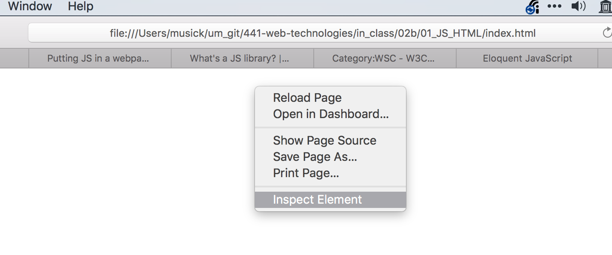
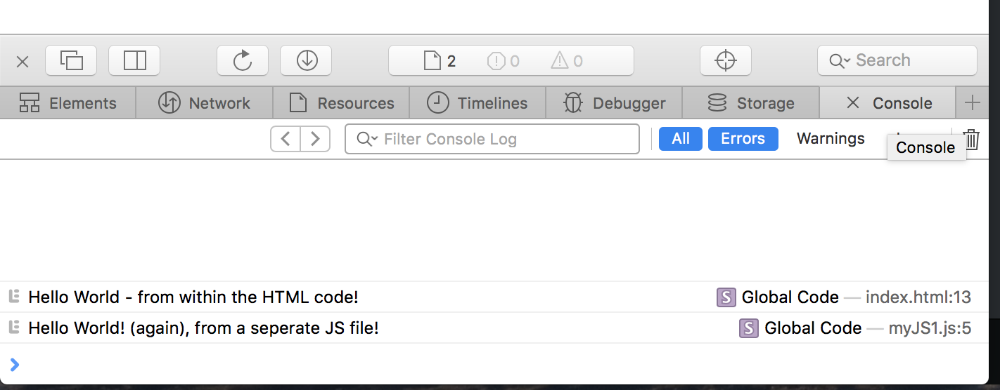

# 2017-02-02

## Topics: JS and the DOM

1. JavaScript and HTML
    - The script element
    - JS Files
    - `console.log()`

    You must open the browsers console to see anything in this initial example.
    Typically, if you right click in a browser window, you can select "inspect element".
    

    Then select the console.
    

    `console.log()` We can use console.log() during development to print to a browsers 'console'.

2. Alerts
    - One of the more annoying things you can do as a developer is use popup alerts.
    - However, they can be useful for the development process and debugging.

3. Script Order
    - Always (or whenever possible) place your JS scripts at the end of the Body Element.
    - Otherwise, they may block other events from occuring.
    - Likewise, place your style sheets or style code up above in the HEAD, to prevent "naked pages".

4. `document.write()`
    - Use document.write to alter the DOM

5. The problwm with `document.write()`
    - The problem with `document.write()` is that it can replace your whole DOM...

6. `getElementById()` & `innerHTML=""`
    - JS is often used to alter, or create html elements.
    - One way of doing this is by using `innerHTML=""` to set the value of an elements html.
    - However, in order for us to use this, we have to tell the DOM, _which_ element we mean.
    - We can do this by first selecting the correct element with a method such as `document.getElementById()`.
